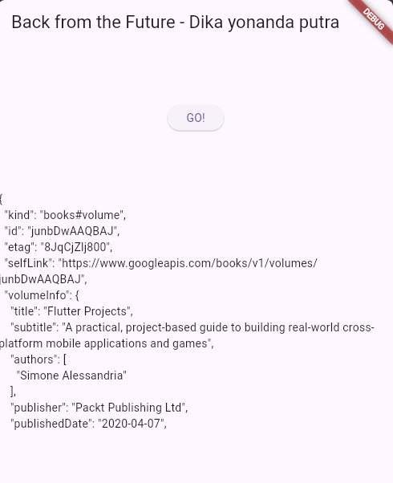

# books

## Praktikum 1
### Soal 2

### Soal 3
- substring mengambil sebagian huruf/karakter di variabel value, dari karakter ke 0 sampai ke 450
- catchError menangkap error dan menampilkannya jika terjadi error pada getData
