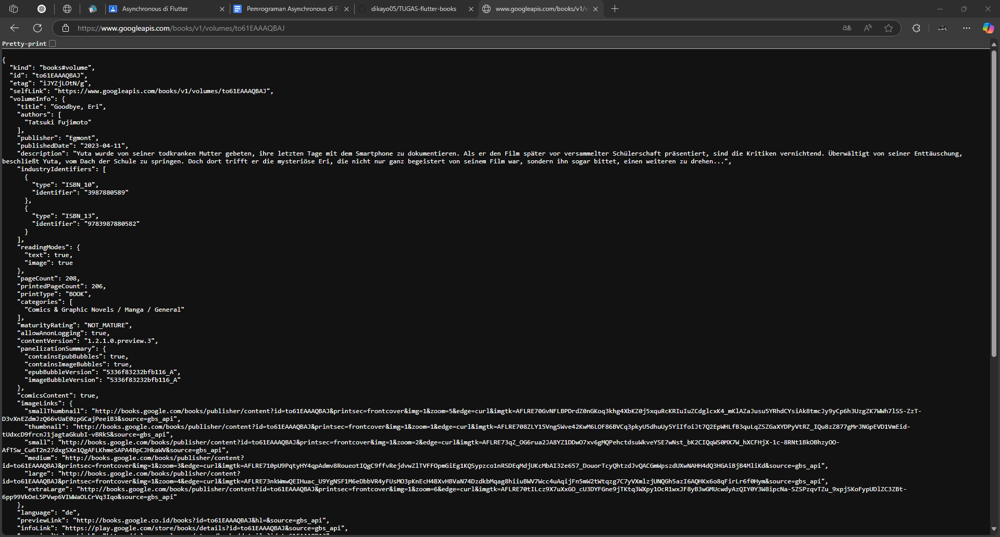
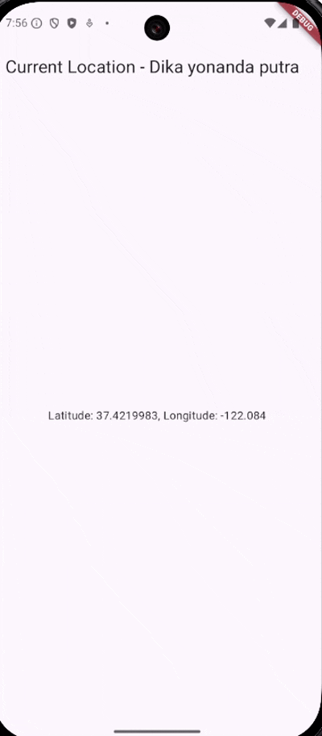

# books

## Praktikum 1
### Soal 2

### Soal 3
- substring mengambil sebagian huruf/karakter di variabel value, dari karakter ke 0 sampai ke 450
- catchError menangkap error dan menampilkannya jika terjadi error pada getData

## Praktikum 2
### Soal 4
- langkah 1, membuat function yang mereturn/mengembalikan/menghasilkan angka setelah 3 detik
- langkah 2, membuat function yang menjumlahkan 3 function pada langkah 1, karena tiap function delay 3 detik jadi dibutuhkan 9 detik untuk mendapatkan hasilnya

## Praktikum 3
### Soal 5
- late Completer completer = membuat variabel yang akan diisi nanti
- function getNumber menginisialisasi variabel completer, mengeksekusi calculate() lalu mengembalikan completer
- function calculate akan menunggu 5 detik lalu mengeksekusi completer yang menghasilkan angka 42

### Soal 6
bedanya hanya pada langkah 5-6 menggunakan try catch untuk menampung error jika memang ada error pada function calculate

## Praktikum 4
### Soal 7

### Soal 8
- FutureGroup bisa menambahkan Future secara dinamis sebelum close() dipanggil (untuk jumlah Future yang belum pasti)
- Future.wait langsung menjalankan Future yang sudah ada dari awal (untuk jumlah Future yang sudah pasti)

## Praktikum 5
### Soal 9

### Soal 10
pada langkah 1, handle errornya dilakukan saat methodnya dipanggil
sedangkan pada langkah 2, handle errornya sudah ada di dalam method, jadi tidak perlu membuat handle error lagi saat memanggil methodnya

## Praktikum 6
### Soal 12
di browser tidak bisa karena kode
<uses-permission android:name="android.permission.ACCESS_FINE_LOCATION"/>
<uses-permission android:name="android.permission.ACCESS_COARSE_LOCATION"/>
itu untuk meminta izin pada perangkat android, bukan browser

## Praktikum 7
### Soal 13
